# Second Brain - AI-Powered Knowledge Management System

> **Transform your thoughts into organized, actionable knowledge without writing a single line of code.**

A fully automated Second Brain system that captures your thoughts from Slack, intelligently classifies them using AI (Google Gemini), and organizes them into structured Notion databases. This system works for you 24/7, turning scattered ideas into compounding knowledge.

---

## 📚 Detailed Documentation

We have moved the deep-dive setup guides to separate documents to keep this README clean:

*   **[1. Notion Setup Guide](/docs/notion-setup.md)** (Critical: Start here to build your database backend)
*   **[2. n8n Workflow Setup](/docs/n8n-setup.md)** (Importing and configuring the engine)
*   **[3. Configuration & Tuning](/docs/configuration.md)** (Adjusting confidence scores and prompts)

---

## 🧠 Why Build a Second Brain?

Your brain wasn't designed to be a storage system—it was designed to **think**. Every time you force your brain to remember something instead of letting it think, you pay an invisible tax:

- **Relationships cool off** because you forgot what mattered to someone
- **Projects fail** in ways you predicted but forgot to document
- **Constant anxiety** from open loops and untracked commitments
- **Lost opportunities** from ideas that never got captured

For 500,000 years, humans have had the same cognitive limitations:
- Working memory: 4-7 items
- Poor retrieval without external systems
- Great at pattern recognition, but only when patterns are visible

**2026 is different.** For the first time in human history, we have AI systems that don't just passively store information—they **actively work on it** while you sleep.

---

## ✨ What This System Does

### Core Capabilities

1. **Intelligent Capture** - Drop thoughts into a Slack channel, one per message
2. **AI Classification** - Google Gemini 2.5 Pro automatically categorizes into:
   - 👥 **People** - Contacts, relationships, follow-ups
   - 📊 **Projects** - Active work with status tracking
   - 💡 **Ideas** - Concepts, insights, future possibilities
   - 📋 **Admin** - Tasks, deadlines, to-dos
3. **Automatic Routing** - Each thought goes to the right Notion database
4. **Confidence Scoring** - Low-confidence items flagged for review
5. **Audit Trail** - Every capture logged with timestamp and metadata
6. **Daily Digest** - Automated morning summary delivered to Slack at 9 AM

### What You Get

- **Lighter cognitive load** - Close all those mental open loops
- **Better continuity** - Show up prepared for people and projects
- **Compounding insights** - Patterns emerge over time
- **Reduced anxiety** - Turn background hum into actionable next steps
- **Restart-friendly** - Life happens; the system waits for you

---

## 🏗️ System Architecture

### Data Collection Flow

```mermaid
graph LR
    A[Slack Channel] -->|Webhook| B[n8n Workflow]
    B -->|Extract Text| C[Google Gemini AI]
    C -->|JSON Response| D{Confidence Check}
    D -->|>0.6| E[Inbox Log]
    D -->|≤0.6| F[Needs Review]
    E --> G{Type Router}
    G -->|people| H[People DB]
    G -->|projects| I[Projects DB]
    G -->|ideas| J[Ideas DB]
    G -->|admin| K[Admin DB]
    F --> L[Manual Review Queue]
```



### Daily Digest Flow


### Technology Stack

- **Capture Interface**: Slack (private channel)
- **Automation Engine**: n8n (workflow automation)
- **AI Classification**: Google Gemini 2.5 Pro
- **Storage**: Notion (5 databases)
- **Integration**: Webhooks + REST APIs

---

## 📊 Notion Database Schemas

### 1. People Database
| Field | Type | Purpose |
|-------|------|---------|
| Name | Title | Person's name |
| Context | Rich Text | How you know them, background |
| Follow-ups | Rich Text | Things to remember/do |
| Last Touched | Date | Last interaction |
| Tags | Multi-select | Categories |

### 2. Projects Database
| Field | Type | Purpose |
|-------|------|---------|
| Name | Title | Project name |
| Status | Select | Active / Waiting / Blocked / Someday / Done |
| Next Action | Rich Text | Immediate next step |
| Notes | Rich Text | Context and details |
| Tags | Multi-select | Categories |

### 3. Ideas Database
| Field | Type | Purpose |
|-------|------|---------|
| Name | Title | Idea name |
| One-liner | Rich Text | Quick summary |
| Notes | Rich Text | Full description |
| Tags | Multi-select | Categories |

### 4. Admin Database
| Field | Type | Purpose |
|-------|------|---------|
| Name | Title | Task name |
| Due Date | Date | Deadline |
| Status | Select | Open / Done |

### 5. Inbox Log (Audit Trail)
| Field | Type | Purpose |
|-------|------|---------|
| Captured Text | Title | Original message |
| Filed To | Select | Destination database |
| Record ID | Rich Text | Execution ID |
| Confidence | Number | AI confidence score (0-1) |
| Timestamp | Date | When captured |
| Needs Review | Rich Text | Flag for low confidence |

---

## 🚀 Setup Guide

*For detailed, step-by-step instructions (including how to create the databases securely), please see the [Notion Setup Guide](/docs/notion-setup.md).*

### Quick Prerequisites

- Slack workspace (free tier works)
- n8n instance (cloud or self-hosted)
- Notion account (free tier works)
- Google Gemini API key

### Step 1: Create Slack Channel

1. Create a new Slack channel (e.g., `#second-brain-inbox`)
2. Make it private if desired
3. Pin a message: *"Drop one thought per message. The AI will file it automatically."*

### Step 2: Set Up Notion Databases

> ⚠️ **Go to [docs/notion-setup.md](/docs/notion-setup.md) for the critical security steps.**

1. Create a new Notion page called "Second Brain"
2. Create 5 database tables using the schemas above
3. Note the database IDs (you'll need them for n8n)

### Step 3: Configure n8n Workflow

1. Import `second-brain.json` into your n8n instance
2. Update credentials:
   - **Slack Webhook**: Configure webhook URL
   - **Google Gemini API**: Add your API key
   - **Notion API**: Connect your Notion workspace
3. Update database IDs in each Notion node
4. Activate the workflow

### Step 4: Test the System

Send a test message to your Slack channel:
```
Met Sarah at the conference. She's working on climate tech. 
Follow up about potential collaboration.
```

Check your Notion - it should appear in the People database!

---

## 🎯 How to Use

### Daily Workflow

1. **Capture** - Throughout the day, drop thoughts into Slack
   - One thought per message
   - No formatting needed
   - Don't overthink it

2. **Trust** - The AI classifies and routes automatically
   - High confidence (>0.6) → Auto-filed
   - Low confidence (≤0.6) → Review queue

3. **Review** - Check your Inbox Log periodically
   - Verify low-confidence items
   - Move to correct database if needed

4. **Act** - Use your databases as your source of truth
   - People: Before meetings/calls
   - Projects: Weekly planning
   - Ideas: Creative sessions
   - Admin: Daily task list

### Best Practices

✅ **DO:**
- Capture immediately when thoughts occur
- Keep messages concise and clear
- Review weekly to spot patterns
- Restart without guilt if you miss days

❌ **DON'T:**
- Try to catch up on backlog (just restart)
- Over-organize (let the AI do it)
- Batch capture (real-time is better)
- Stress about perfect classification

---

## 🔧 Engineering Principles

This system is built on 12 core principles for scalable personal automation:

1. **Design for capture friction, not organization friction**
2. **Automate the boring, preserve the human judgment**
3. **Build for the 80% case, handle the 20% manually**
4. **Make the system legible to non-technical users**
5. **Optimize for restart, not perfection**
6. **Use confidence scores to route edge cases**
7. **Log everything for debugging and trust**
8. **Separate capture from processing**
9. **Start simple, add sophistication only when needed**
10. **Build for restart, not perfection**
11. **Build one workflow, then attach modules**
12. **Optimize for maintainability over cleverness**

---

## 📁 Project Structure

```
second-brain/
├── second-brain.json       # n8n workflow definition
├── docs/                   # Detailed setup guides
├── README.md              # This file
```

---

## 🔐 AI Classification Prompt

The system uses a strict JSON schema for classification:

```
You are a strict JSON generator for a Second Brain system.

Your task:
1. Classify the input into ONE of these types:
   - people
   - projects
   - ideas
   - admin

2. Based on the type, output JSON that matches the EXACT schema for that type.

You MUST output valid JSON only.
No markdown. No explanation. No extra keys. No missing keys.
```

**Confidence Scoring:**
- `>0.6` = Auto-file with confidence
- `≤0.6` = Flag for manual review
- Ensures quality without blocking automation

---

## 📬 Daily Digest Workflow

The system includes an automated daily digest that runs every morning at 9 AM:

### How It Works

1. **Schedule Trigger** - Activates daily at 9:00 AM
2. **Data Collection** - Fetches records from all 4 databases (People, Projects, Ideas, Admin)
   - Filters: Records edited on or before today
3. **Aggregation** - JavaScript code combines all records into a single dataset
4. **AI Summary** - Google Gemini generates a concise executive summary:
   - Max 150 words
   - Plain text (no markdown)
   - Calm, direct, practical tone
5. **Delivery** - Posted to your Slack `#sb-inbox` channel

### Digest Format

The AI creates a structured summary with:
- **Today's focus** - Top 3 priority items
- **Overdue/risky items** - Anything requiring immediate attention
- **Progress notes** - Small wins or recent updates

### Customization

You can adjust:
- **Timing**: Change `triggerAtHour` in the Schedule Trigger node (default: 9 AM)
- **Tone**: Modify the system prompt in the "Message a model" node
- **Length**: Adjust max word count in the prompt (default: 150 words)
- **Filters**: Change date filters to show different time ranges

---

## 🎨 Additional Customization Ideas

Once your core loop is working, you can extend with:

- **Voice Capture** - Integrate with voice memos
- **Meeting Prep** - Pull relevant people/projects before meetings
- **Email Forwarding** - Forward important emails to Slack
- **Birthday Reminders** - Auto-surface from People database
- **Weekly Review** - Automated rollup of the week
- **Custom Digest Times** - Add evening or weekend summaries

**Remember:** Build the core loop first. Add modules only when you have evidence they're needed.

---

## 🤔 Troubleshooting

### Workflow not triggering
- Check Slack webhook URL is correct
- Verify webhook is active in n8n
- Test with a simple message

### AI classification errors
- Review confidence scores in Inbox Log
- Adjust prompt if consistent misclassification
- Use manual review queue for edge cases

### Notion connection issues
- Verify API token hasn't expired
- Check database permissions
- Reconnect integration if needed

### Low confidence scores
- Make Slack messages more explicit
- Add context to ambiguous thoughts
- Review and reclassify in Notion

---

## 📈 Success Metrics

You'll know the system is working when:

- ✅ You feel **lighter** - fewer open loops in your head
- ✅ You show up with **more continuity** for people and projects
- ✅ You can **restart easily** after missing days
- ✅ **Patterns emerge** from your captured thoughts
- ✅ Anxiety shifts from "what am I forgetting?" to "what's next?"

**This isn't about productivity theater. It's about giving your brain the support system it deserves.**

---

## 🙏 Credits & Philosophy

This system is based on the Second Brain methodology and modern AI automation principles. It's designed for **2026 and beyond**, where AI doesn't just store—it actively works on your behalf.

> "For the first time in human history, you have access to systems that will work for you while you sleep. That classify your thoughts without you deciding, that surface the right information without you searching, that nudge you toward the goals and priorities you've set without you having to remember them."

---

## 📝 License

This project is open source and available for personal and commercial use. Feel free to adapt, extend, and share!

---

## 🚀 Get Started

1. Clone this repository
2. Follow the setup guide above
3. Start capturing thoughts
4. Watch your second brain come alive

**The best time to build a second brain was yesterday. The second best time is now.**

---

*Built with ❤️ for humans who think too much and remember too little.*
